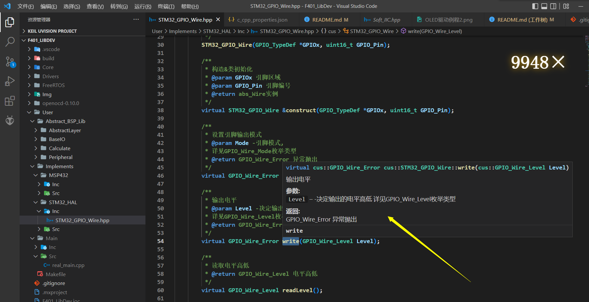
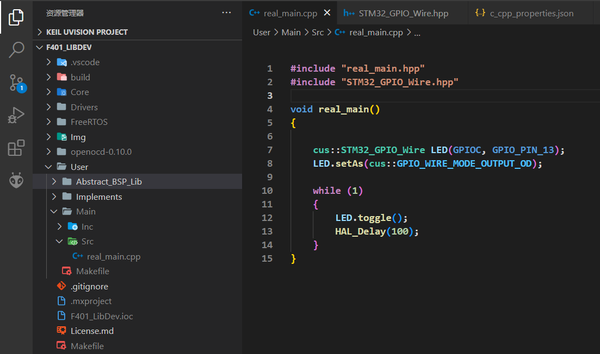
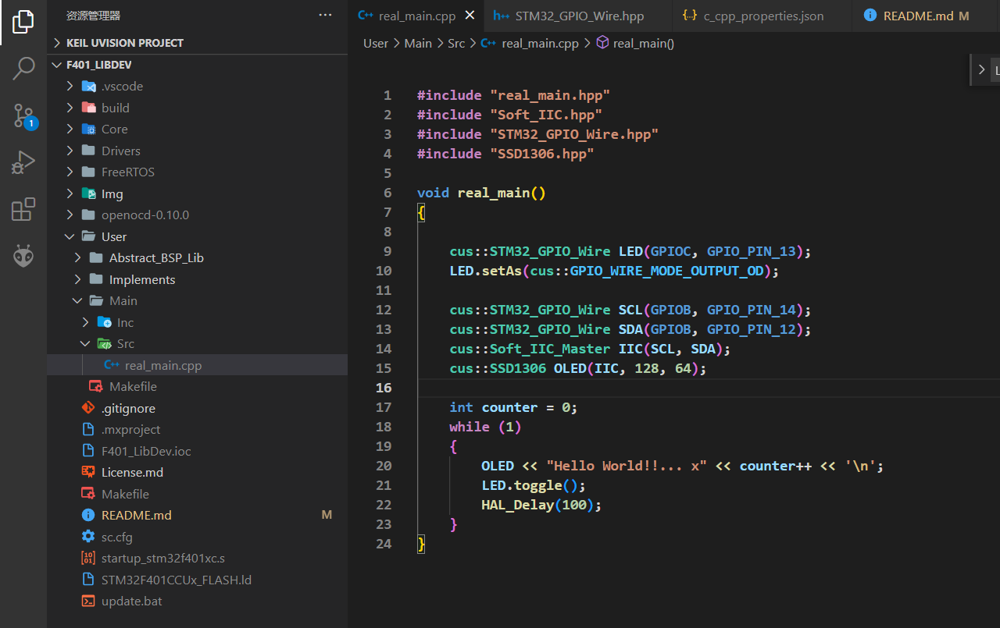
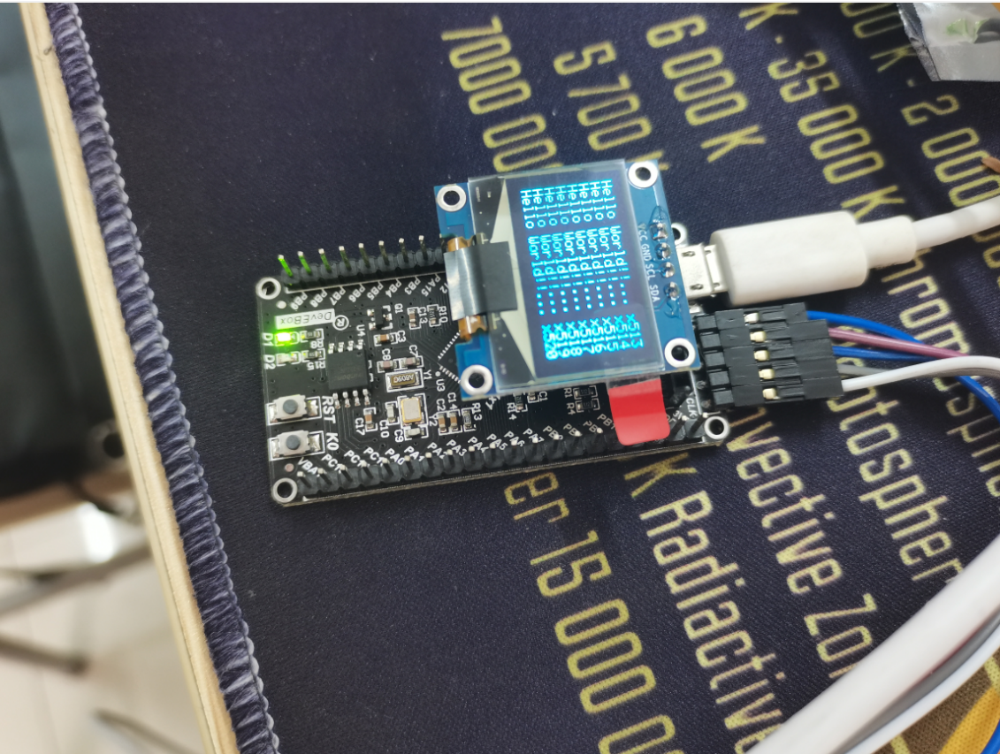

## 这是个啥？
嘿，首先恭喜你发现这里，看名字就应该知道，这是一个类库开发区，目前是由开发者个人`@LuChiChick`进行维护的面向所有支持以C++开发方式的单片机的通用类库，因为是个人维护所以更新的内容基本上都是开发者日常使用中遇到功能需求或者兴趣方向，这也是使用C++的原因之一，另外的原因就是C++类继承体系可以很方便的构建可重复利用的代码及以Top-Down的思维方式加速项目开发；目前仓库内东西很少野心很大，但是常用的GPIO等等使用类库还是非常好使的，并且本仓库极其容易复刻，如果你有任何想法，也可以随时在`issue`板块提出，或者换欢迎直接参与到类库的开发与维护中来（不如说放出来的目的就是这个）。  

因为本人也在学习摸索，所以要求自己严格按照命名及注释规范去编写，我敢说这应该是有史以来你遇到的注释最完善的**中文**MCU相关项目了，在合适的IDE（例如VsCode）加持下看起来是这样子的（这里实名Diss Keil的古早界面和难顶的代码提示及使用体验）:  
  

本项目仓库已经过验证在Keil（Ue5及更高版本）及Arm-GCC环境下能够正常编译下载及调试，放心食用。  
目前仅有STM32及MSP432部分实现，但移植到Arduino等支持C++开发的单片机中会非常快（已经试过在其他平台上移植啦~）。  

食用方法及文件依赖关系待更新中.......
## 项目Wiki
这个待更新，毕竟写Wiki怪麻烦的，但是我觉得有必要写一篇完整的功能文档

## 主要目录及说明
    Git-Storage             本仓库目录
        ├─Img               本仓库所用到的一些图像
        ├─User              用户层
        │   ├─Abstract_BSP_Lib          抽象类库主体
        │   │   ├─AbstractLayer         抽象层相关
        │   │   │   ├─Inc
        │   │   │   │   ├─Abs_GPIO_Wire.hpp             抽象GPIO类库
        │   │   │   │   ├─Abs_IIC.hpp                   抽象IIC通信类库
        │   │   │   │   ├─Abs_IO_Stream.hpp             抽象输入输出流通信类库
        │   │   │   │   ├─Abs_Monochrome_Screen.hpp     抽象单色屏驱动类库
        │   │   │   │   └─Abs_PWM_Generator.hpp         抽象PWM生成器类库
        │   │   │   └─Src
        │   │   │       ├─Abs_IO_Stream.cpp             抽象输入输出流部分基础实现
        │   │   │       ├─Abs_Monochrome_Screen.cpp     抽象单色屏部分基础实现
        │   │   │       └─AbstractLayer.cpp             抽象层编译接口实现
        │   │   ├─BaseIO                基础IO相关
        │   │   │   ├─Inc
        │   │   │   │   └─Soft_IIC.hpp                  软件模拟IIC类库
        │   │   │   └─Src
        │   │   │       └─Soft_IIC.cpp                  软件模拟IIC实现
        │   │   ├─Calculate             计算工具相关
        │   │   │   ├─Inc
        │   │   │   │   └─Calculate.hpp                 计算工具类库               
        │   │   │   └─Src
        │   │   │       ├─Calculate.cpp                 计算工具实现
        │   │   │       ├─Kalman_fliter.cpp             卡尔曼滤波实现
        │   │   │       └─PID.cpp                       PID算法类实现
        │   │   └─Peripheral            外设相关
        │   │       ├─Inc
        │   │       │   ├─Servo.hpp                     舵机控制类库
        │   │       │   └─SSD1306.hpp                   SSD1306单色OLED驱动类库
        │   │       └─Src
        │   │           ├─Servo.cpp                     舵机控制类库具体实现
        │   │           └─SSD1306.cpp                   SSD1306单色OLED驱动类库具体实现
        │   └─Implements                具体平台实现层
        │       ├─MSP432                MSP432_DriverLib实现
        │       │   ├─Inc                   
        │       │   │   ├─MSP432_GPIO_Wire.hpp          MSP432_GPIO类库
        │       │   │   ├─MSP432_PWM_Generator.hpp      MSP432_PWM生成器类库
        │       │   │   └─MSP432_Uart.hpp               MSP432_Uart串口类库
        │       │   └─Src
        │       │       ├─MSP432_GPIO_Wire.cpp          MSP432_GPIO类库具体实现
        │       │       ├─MSP432_PWM_Generator.cpp      MSP432_PWM生成器类库具体实现
        │       │       └─MSP432_Uart.cpp               MSP432_Uart串口类库具体实现
        │       └─STM32_HAL             STM32_HAL库实现
        │           ├─Inc
        │           │   └─STM32_GPIO_Wire.hpp           STM32_GPIO类库
        │           └─Src
        │               └─STM32_GPIO_Wire.cpp           STM32_GPIO类库具体实现   
        ├─.gitignore        忽略文件
        ├─License.md        本仓库的开源协议，请务必遵守哦
        └─README.md         本仓库的自述文件

## 食用方法
前提是你需要一个能够正常编译及下载的MCU工程，这里以简单的GPIO封装类型`STM32_GPIO_Wire`类为例，你需要将`STM32_GPIO_Wire.hpp`及其依赖项`Abs_GPIO_Wire.hpp`添加进工程包含目录，并将`STM32_GPIO_Wire.cpp`及`AbstractLayer.cpp`加入工程编译，并且，`STM32_GPIO_Wire`类型仅能在C++源文件中`cus`名称空间下使用，所以推荐将`main.c`改为`main.cpp`，并将原来的包含全部以`extern "C"`的形式重新包含后构建整个工程，下面我们使用`STM32_GPIO_Wire`设置开漏输出模式点亮一个连接在PC13的LED，工程为STM32CubeMX生成的F401CCU6芯片Makefile工程，为了方便使用C++并且避开CubeMX生成的繁杂注释，本人在`main.h`及`main.c`中添加了一条`void real_main(void);`函数定义，并在main函数`while(1)`循环前跳转到该函数执行，同时将该函数在C++源文件下实现：  

  

以上我们便声明了一个`STM32_GPIO_Wire`类型实例对象LED，并且使用类成员函数方便地实现了100ms闪烁LED。  

此外在实现`Abs_GPIO_Wire`的基础上（例如`STM32_GPIO_Wire`就是其一种具体实现），就已经可以使用软件模拟IIC主机类型`Soft_IIC_Master`驱动本库内提供的SSD1306（常见的128x64串口屏用的就是这种主控芯片）类型实例，实现屏幕相关功能，其提供了一个不用重定向`fputc()`就能实现的全功能`printf`函数及`<<`重定向：  

  
  

后续内容参见项目Wiki

## 更新日志
```log
2022\08\06:
-20:25
    抽象单色屏类库错误类型添加，重构SSD1306驱动类库中
-19:30
    抽象单色屏添加指定位置打印字符声明
-04:08
    为抽象单色屏类库实现了两个成员函数
    规范了一些命名方式
2022\08\05:
-22:50
    食用方法更新
-21:20
    目录框架搭建完成
-20:50
    增加开发日志
    工程目录整理并更新README
    决定以GPL_V3许可协议在GitHub开源

```